# Graduate Starting Salary Predictor
Using regression modules to predict the starting salaries of graduates

## Purpose

This case study explores the challenge of predicting a graduate’s starting salary using regression techniques. The project was initially set up to leverage academic metrics (such as GPA and SAT scores), extracurricular experiences (including internships, projects, and certifications), and other key factors. However, the data revealed several limitations that affected the model's predictive power. Rather than simply aiming for high accuracy, the focus shifted to understanding the intricacies of real-world data—identifying inherent biases and methodological challenges. Ultimately, this case study serves as both an exploration of regression-based prediction methods and a learning opportunity on how data quality and survey design can shape outcomes in applied machine learning projects.

## Dataset

- **Source:** [Education and Career Success Dataset](https://www.kaggle.com/datasets/adilshamim8/education-and-career-success/data)
- **Overview:**  
  The dataset contains 5,000 records capturing students’ academic backgrounds, skills, and early career outcomes. Key features include:
  - **Academic Metrics:** High School GPA, University GPA, SAT Score, University Ranking
  - **Extracurricular Experiences:** Internships, Projects, Certifications, Soft Skills, Networking Scores
  - **Career Outcomes:** Starting Salary, Job Offers, Career Satisfaction
 

  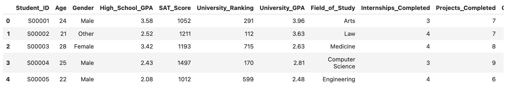

## Exploratory Data Analysis

Notably, there were several peculiar features discovered about the dataset. For example, the target variable (starting salary) did not change with features as one would expect (e.g., the relationship between salary and the number of internships was not evident). This raised concerns about whether the dataset captures real-world dynamics accurately.

  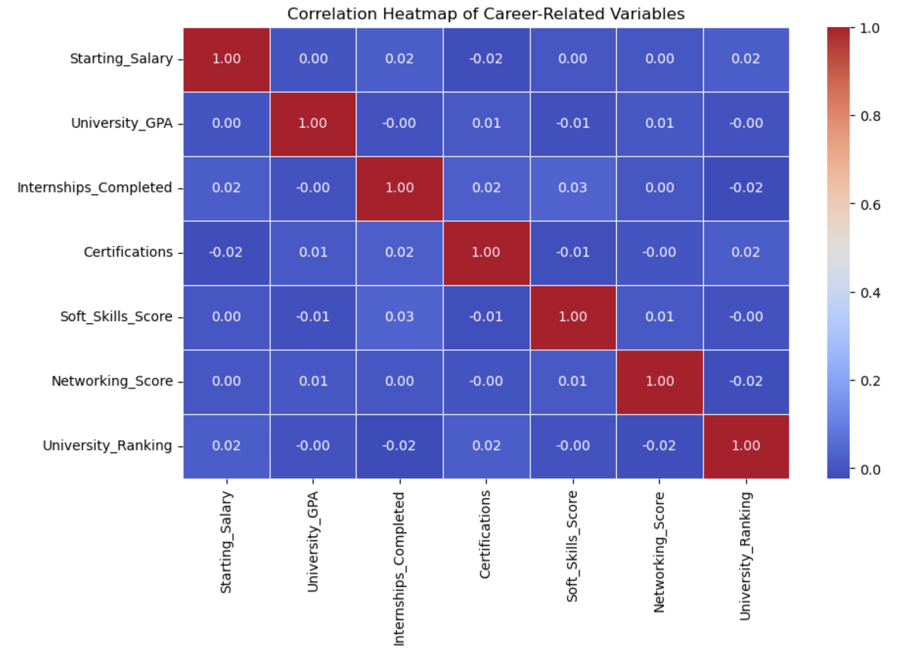
  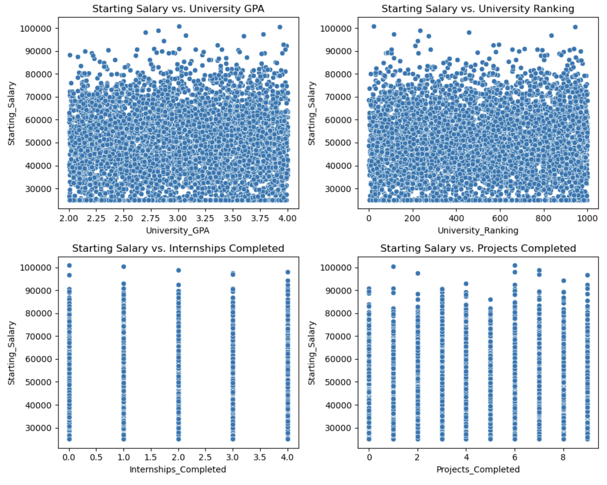

Histograms for various variables suggested that the data was not collected from a traditional survey but rather appears to be randomly generated to follow pre-defined distributions. For example, the salary variable approximates a normal distribution with left-hand censoring, and many feature variables are uniformly distributed.

  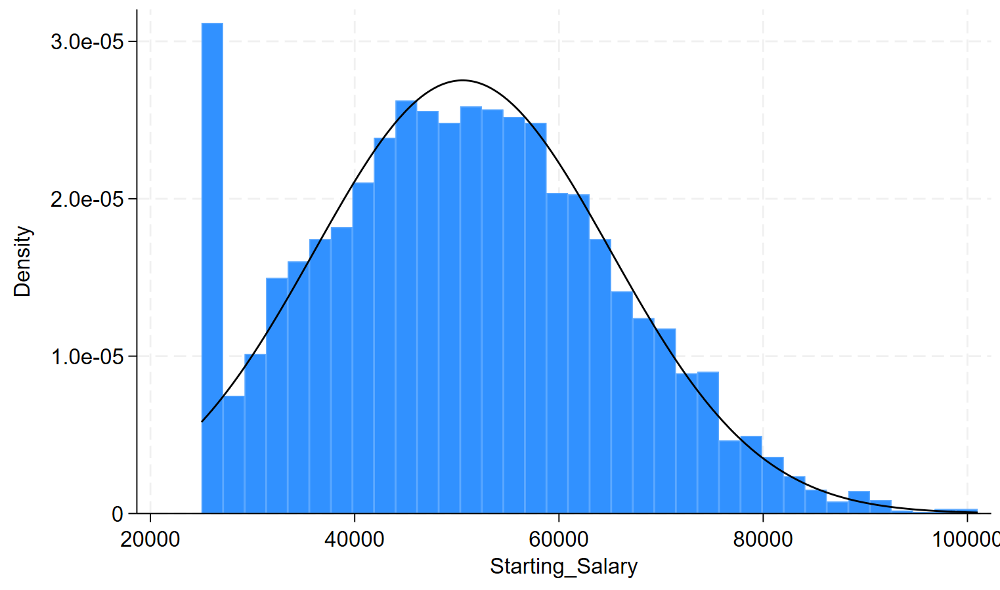

  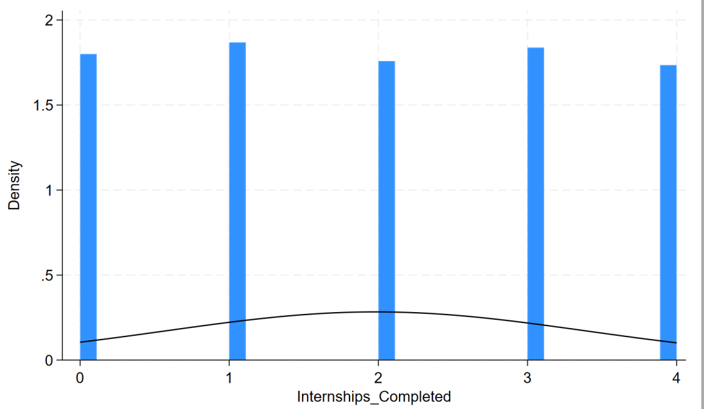

Additionally, the survey methodology seems to have involved stratified sampling along gender lines, which resulted in oversampling of minority genders in certain fields. For instance, the dataset shows nearly a 50/50 gender split among computer science graduates, even though actual data indicates that about 75% of CS degrees are awarded to males [Statista](https://www.statista.com/statistics/1473178/new-computer-science-graduates-genders-us-canada/).

  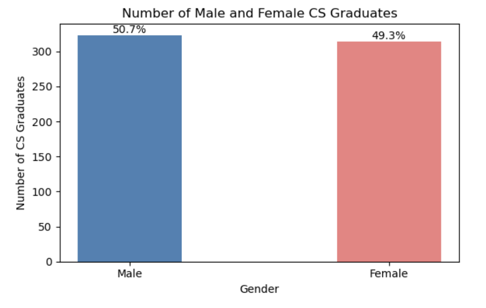

 
## Model Selection

Several regression models were implemented and compared to predict graduate starting salaries. Here’s a more detailed breakdown of each:

### 1. Feedforward Neural Network
- **Framework:** Implemented using PyTorch.
- **Architecture:**  
  - Two hidden layers with ReLU activation functions.
  - The network architecture was designed to capture non-linear relationships in the data.
- **Training Strategy:**  
  - Data was split into 70% for training, 20% for testing, and 10% for validation.
  - Mean Squared Error (MSE) was used as the loss function, and the model’s performance was tracked by monitoring RMSE over multiple epochs.
- **Objective:**  
  - To leverage deep learning for capturing complex patterns that traditional linear models might miss.

### 2. Linear Regression
- **Purpose:** Served as a baseline model to set a reference performance.
- **Method:**  
  - A simple linear model that assumes a linear relationship between the predictors (e.g., GPA, internships) and the starting salary.
- **Evaluation Metrics:**  
  - Evaluated using RMSE, Mean Absolute Error (MAE), and the R² score on both test and validation sets.
- **Strengths & Limitations:**  
  - Quick to train and interpret, but may underfit if the relationships in the data are non-linear.

### 3. Ridge and Lasso Regression
- **Approach:**  
  - Both are extensions of linear regression that include regularization terms.
- **Ridge Regression:**  
  - Adds an L2 penalty to the loss function, which helps to shrink the coefficients and reduce overfitting.
- **Lasso Regression:**  
  - Incorporates an L1 penalty, which can drive some coefficients to zero, effectively performing feature selection.
- **Insights:**  
  - Coefficient analysis revealed that features such as internships and soft skills have strong predictive power for starting salaries.
- **Evaluation:**  
  - Performance was compared via RMSE on the validation set, and both methods provided similar error rates, with Ridge slightly outperforming Lasso.

### 4. OLS Regression
- **Method:**  
  - Ordinary Least Squares regression was implemented using Statsmodels.
- **Enhancements:**  
  - Interaction terms were introduced (e.g., combining top university ranking with fields of study like business or law) to capture synergistic effects.
- **Evaluation:**  
  - Performance was measured using adjusted R² to account for the number of predictors, alongside RMSE.
- **Interpretation:**  
  - The OLS model provided a detailed statistical summary, including p-values and confidence intervals for each predictor, which helped in understanding the significance of the factors involved.

### 5. Model Comparison
- **Comparative Analysis:**  
  - All models were evaluated on the same validation set with RMSE as the primary metric.
    
## Results 

### Simple Feedforward Neural Network

  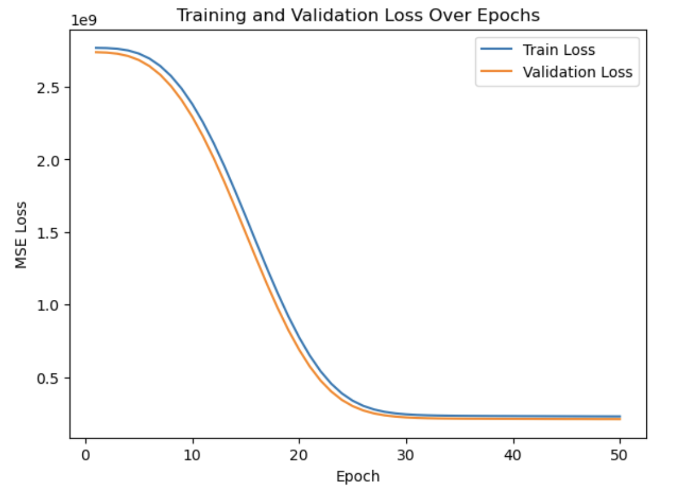
  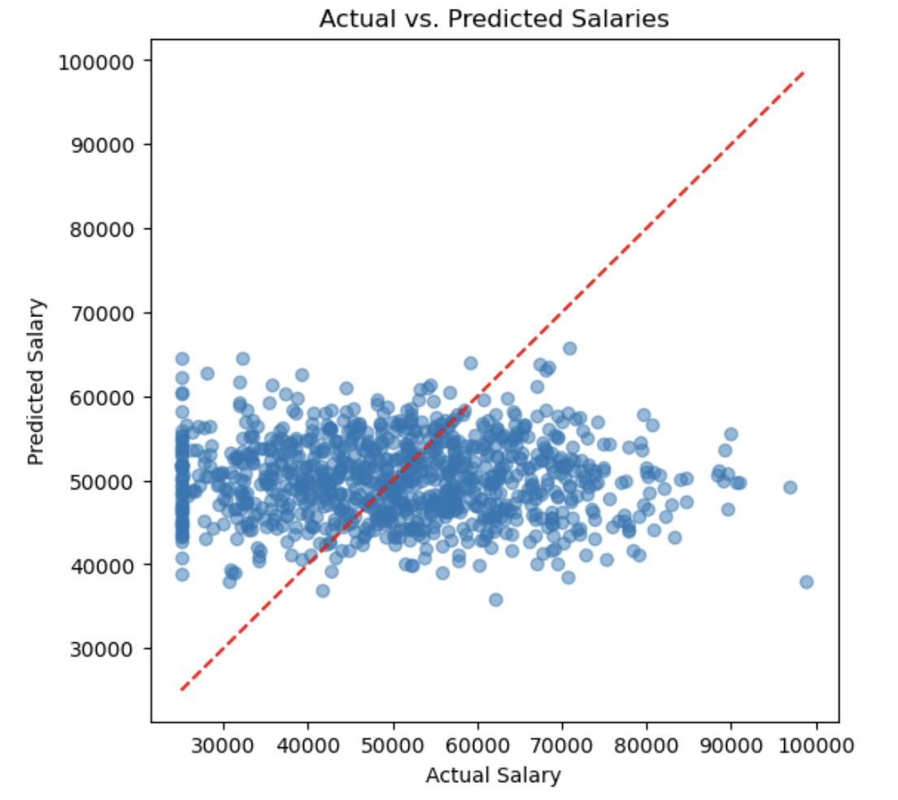

Although the network learned useful representations without overfitting, the predictive power is not strong. This can be explained by the relatively low sample size (5000) of the dataset for training a neural network.

### Linear Regression

  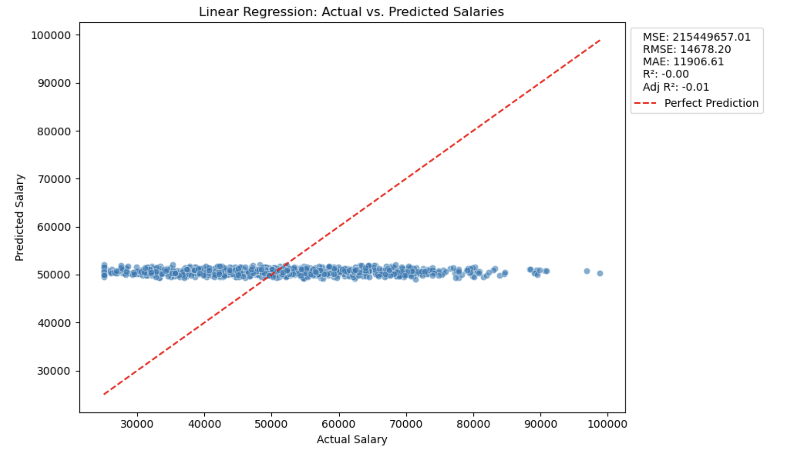

### Ridge and Lasso Regression

  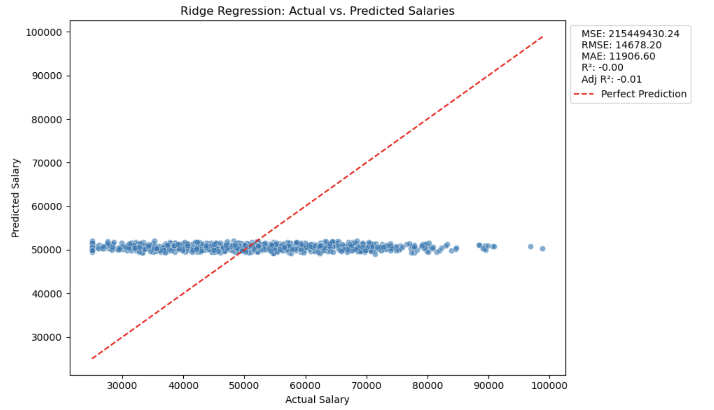
  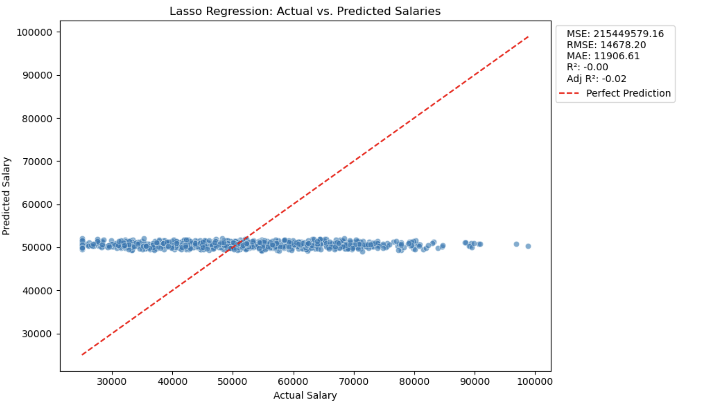

### OLS Regression

  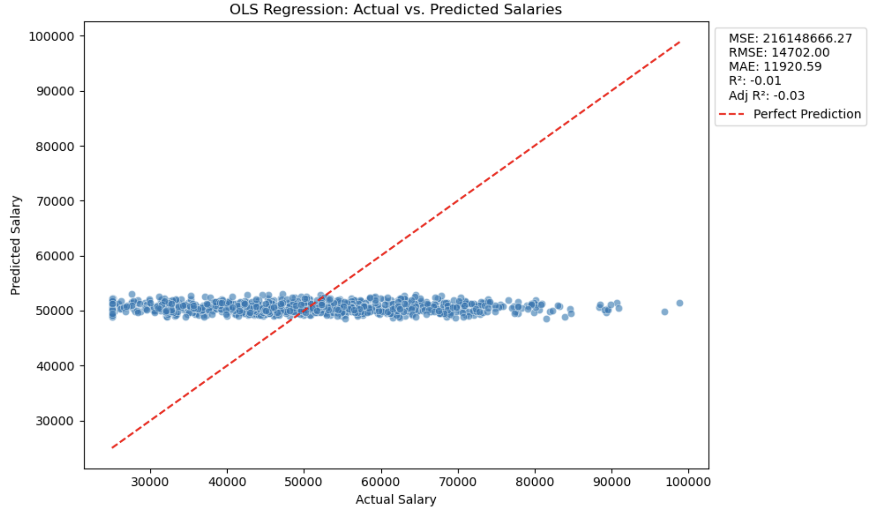

### Model Comparison

  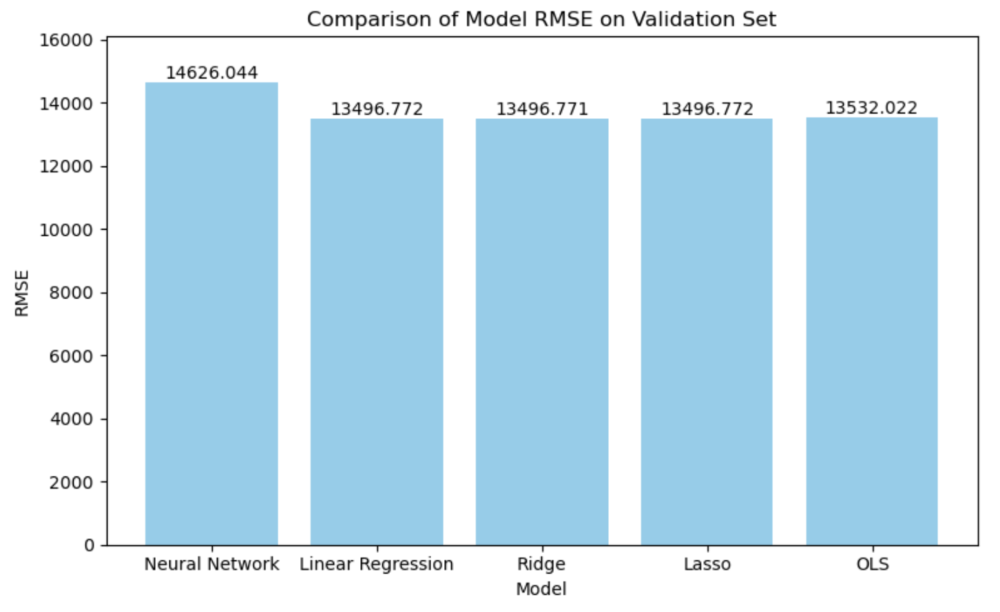

All the models lacked strong predictive power, but the Ridge regression model performed the best with the lowest RMSE.

### Final Ridge Regression Results

  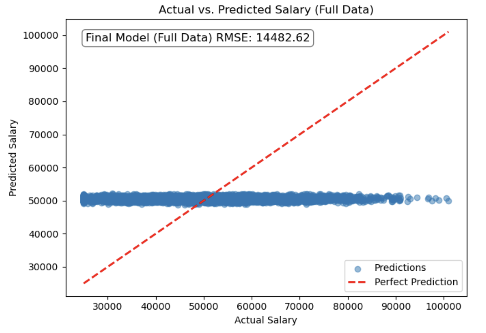
  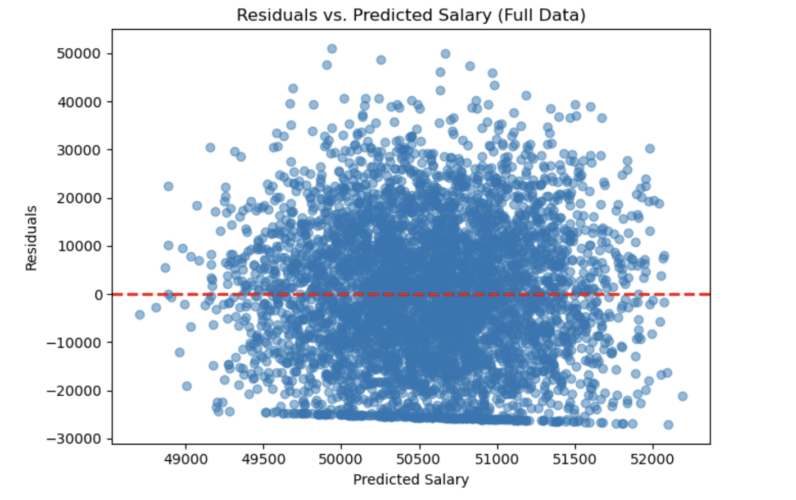

## Conclusions

This project aimed to predict graduate starting salaries using academic and skill-based factors. However, data analysis revealed weak correlations between key features and salary—likely due to dataset issues such as signs of potential fabrication. 

Although the all final models (Ridge Regression, Neural Networks) did not deliver strong predictive power, they provided valuable insights into data integrity challenges and the importance of dataset selection. The model was deployed as a salary calculator to demonstrate practical applications of regression-based predictions, highlighting that understanding and documenting data limitations is as important as model accuracy in real-world projects.

## Technologies Used

- **Python 3.x**
- **PyTorch** (for the neural network model)
- **scikit-learn** (for Linear, Ridge, Lasso, and OLS regression)
- **Pandas & NumPy** (for data manipulation)
- **Matplotlib & Seaborn** (for data visualization)
- **Statsmodels** (for OLS regression analysis)
